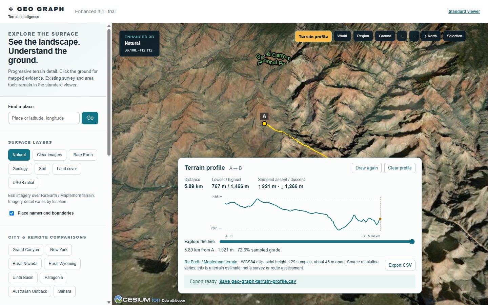

# Geo Graph

**Explore 3D terrain, inspect published ground evidence, and export what you find.**

Geo Graph is a browser-based field survey workspace. The standard MapLibre viewer combines terrain, imagery, mapped soil, surface geology, and public well records. An optional Cesium viewer adds globe navigation and interactive terrain profiles. The Uinta Basin pilot gives you a starting point with real public data.

This repository contains application source and local launchers. Running it starts a server on your computer and opens the interface in your browser. There is no standalone `.exe` installer or native desktop application in this repository.



*Enhanced 3D: a sampled terrain profile across the Grand Canyon. The standard survey workspace opens by default.*

## Contents

- [What you can do](#what-you-can-do)
- [Requirements](#requirements)
- [Download the application](#download-the-application)
- [Install and launch on Windows](#install-and-launch-on-windows)
- [Install from a terminal](#install-from-a-terminal)
- [Run the production demo](#run-the-production-demo)
- [Your first survey](#your-first-survey)
- [Navigate the map](#navigate-the-map)
- [Use the standard viewer](#use-the-standard-viewer)
- [Use enhanced 3D](#use-enhanced-3d)
- [Export and save your work](#export-and-save-your-work)
- [Session storage and privacy](#session-storage-and-privacy)
- [Update or remove the application](#update-or-remove-the-application)
- [Troubleshooting](#troubleshooting)
- [Commands and development](#commands-and-development)
- [Data sources and interpretation limits](#data-sources-and-interpretation-limits)
- [Further documentation](#further-documentation)

## What you can do

| Feature | Where to use it |
| --- | --- |
| Navigate terrain, imagery, and published map layers | Both viewers |
| Search for places or enter coordinates | Both viewers |
| Inspect soil, surface geology, and elevation context at a point | Both viewers |
| Switch among Overview, Wellsite, Agriculture, Water, Construction, and Environment | Standard viewer |
| Compare nearby public Utah oil and gas well records | Standard viewer, Wellsite workspace |
| Select a rectangular area and sample five positions | Standard viewer |
| Export a point report, JSON, GeoJSON, or soil-profile report | Standard viewer |
| Preview a local LAS 2.0 depth curve and regional research-core reference | Standard viewer, Wellsite workspace |
| Draw an elevation profile and export its samples as CSV | Enhanced 3D |
| Compare land cover and a USGS relief overlay | Enhanced 3D |

Geo Graph presents published records and derived terrain context. It supports exploration and preliminary screening; it does not perform a field measurement or establish site-specific engineering conditions.

## Requirements

| Requirement | Details |
| --- | --- |
| Node.js and npm | Node.js **22.13 or newer** is required by the launchers. The recorded Windows validation used **Node.js 24.19.0**. npm installs the dependencies. |
| Browser | A browser with WebGL enabled is required. Enhanced 3D loads an additional rendering engine and may need more graphics resources. |
| Internet | Required for initial dependency installation and live terrain, imagery, search, and evidence services. This is not an offline map package. |
| Writable project folder | Extract or clone into a folder where your user account can create files. |
| Git, optional | Needed for cloning and Git updates. ZIP installation does not require Git. |

Get Node.js from its [official website](https://nodejs.org/). Close and reopen terminals after installing it so they pick up the updated `PATH`.

Windows has double-click launchers. macOS and Linux use the terminal workflow below; the recorded interview validation was performed on Windows. Local use does not require Docker, a Cloudflare account, API keys for the currently configured public sources, or a separate database setup. Geo Graph's launchers do not need to run as administrator.

## Download the application

### Option A: Download a ZIP

1. Open the [Geo Graph repository](https://github.com/Shingenn5/Geo-Graph).
2. Select **main**, then choose **Code → Download ZIP**. Alternatively, use the [direct main-branch ZIP](https://github.com/Shingenn5/Geo-Graph/archive/refs/heads/main.zip).
3. Extract the entire archive. On Windows, right-click the ZIP and choose **Extract All**.
4. Open the extracted folder, usually `Geo-Graph-main`.
5. Confirm that this folder contains `package.json`, `README.md`, and `Install Geo Graph.cmd`.

Run the launchers from the extracted project, not from inside the ZIP. Do not move just the `.cmd` files elsewhere: they need the project beside them. If extraction creates an extra outer folder, open the inner folder containing `package.json`.

### Option B: Clone with Git

With Git installed, open a terminal in the parent folder where you want the project:

```sh
git clone --branch main https://github.com/Shingenn5/Geo-Graph.git
cd Geo-Graph
```

A clone can be updated later with Git. If GitHub denies access, check that you are signed in with an account that has repository access before troubleshooting local installation.

## Install and launch on Windows

### 1. Check Node.js and npm

Open PowerShell or Command Prompt:

```powershell
node --version
npm.cmd --version
```

Node must report 22.13 or newer. If either command is not found, finish installing Node.js/npm and open a new terminal.

### 2. Install the project

Double-click [Install Geo Graph.cmd](Install%20Geo%20Graph.cmd) in the extracted or cloned project folder.

The installer downloads versions recorded in `package-lock.json`, prepares MapLibre workers, copies Cesium static assets, and records installation readiness. First setup requires internet. Wait for **Setup complete** before continuing. If it fails, keep the error text shown in the window.

### 3. Open Geo Graph

Double-click [Start Geo Graph.cmd](Start%20Geo%20Graph.cmd). It checks the installation, performs setup if needed, starts the local development server, and opens your default browser when the application responds.

Open **<http://127.0.0.1:5173>** manually if necessary. Wait for **SYSTEM READY** before selecting ground. Terrain and evidence can continue loading after the interface becomes ready.

### 4. Keep the server running

Leave the launcher's terminal window open while using the application. Press **Ctrl+C** in that window to stop it. Closing the browser tab alone does not stop the server. The local address works on the computer running the launcher.

Later starts normally reuse the installation. A changed package manifest, lockfile, Node version, operating system, or architecture makes the setup check request a fresh installation.

## Install from a terminal

Run these commands from the project root—the folder containing `package.json`:

```sh
npm run setup
npm run doctor
npm run launch
```

In Windows PowerShell, use the command shims if execution policy blocks `npm.ps1`:

```powershell
npm.cmd run setup
npm.cmd run doctor
npm.cmd run launch
```

**Expected result:** setup finishes, doctor reports Node and assets as ready, and launch prints `Geo Graph is ready: http://127.0.0.1:5173`.

To launch without opening a browser:

```sh
npm run launch -- --no-browser
```

On macOS/Linux, open the printed URL yourself if the system browser-opening command is unavailable. Use `npm run setup` for the full first-time workflow: dependency installation and renderer asset preparation happen together.

## Run the production demo

A prepared production build is useful for presentations. It uses a different port from the everyday launcher.

1. Run `npm run setup` if this is a fresh checkout.
2. Stop running Geo Graph servers before building.
3. Prepare the production build and verify viewer assets:

   ```sh
   npm run demo:prepare
   ```

4. Double-click [Demo Geo Graph.cmd](Demo%20Geo%20Graph.cmd), or run:

   ```sh
   npm run demo
   ```

5. Open **<http://127.0.0.1:8789>** and keep its server window open.
6. Open a second terminal in the project folder and check the live demo sources:

   ```sh
   npm run demo:check
   ```

The preflight reports `PASS` or `FAIL` for health, pilot soil/geology/wells/provenance, search, a geology PNG, empty soil coverage, and invalid inputs. Investigate failures before presenting. A pass records source availability at that moment; it is not an uptime promise.

Results go into `outputs/demo-readiness/api-checks.json`. When pilot evidence requests succeed, the check also writes:

| File in `outputs/demo-readiness/` | Purpose |
| --- | --- |
| `pilot-survey.html` | Printable local backup report; open directly from your file manager. |
| `pilot-survey.json` | Structured point evidence snapshot. |
| `pilot-source-responses.json` | Timestamped raw responses for the pilot sources. |

`outputs/` is ignored by Git. These backups are local files; copy them with your presentation materials.

The demo launcher reuses an already healthy Geo Graph server on port 8789. It **does not rebuild automatically**. After application source changes, stop the server, run `npm run demo:prepare`, and relaunch. `npm run demo -- --no-browser` suppresses automatic browser opening.

Use the [five-minute interview guide](docs/interview-demo.md) and [dated validation record](docs/demo-readiness.md). Manually rehearse one report and CSV download in your presentation browser: embedded-browser download automation did not verify file transfers during the recorded rehearsal.

## Your first survey

1. Launch the application and wait for the map controls to become enabled.
2. Choose **Explore Uinta Basin pilot →** in the sidebar.
3. Wait for the map to move near Roosevelt, Utah. The shortcut selects **Wellsite** and queries soil, geology, public wells, and source-quality metadata.
4. **Results** opens automatically. Open **Ground**, then switch between **Geology** and **Soil**; expand **Additional survey fields** and **Survey source**.
5. In **Results → Wells**, choose a record to inspect its published surface location. This selects a new point and refreshes the evidence.
6. Open **Results → Sources** and read **What supports this view?** for imagery catalog context and the independent USGS elevation check.
7. Use the export buttons in **Results → Overview**. Choose **Printable survey** or **JSON**, and save the file.
8. Choose **Enhanced 3D ↗**, select **Grand Canyon**, and draw a terrain profile using the steps below.

Search, point/area selection, map scale, and the **Explore / Layers / Results / Areas** navigation stay within reach as you scroll. Results has direct **Overview**, **Ground**, **Wells**, **Logs & depth**, and **Sources** buttons, so evidence does not stack into one long page. On smaller displays, the map sits between navigation and panel content; choosing a panel moves to its content. A selected point or area has a **View results →** shortcut on the map.

## Navigate the map

| Action | Standard viewer | Enhanced 3D |
| --- | --- | --- |
| Move | Left-drag the map | Left-drag the globe |
| Tilt/orbit | Right-drag | Right-drag |
| Zoom | Mouse wheel or zoom buttons | Mouse wheel or zoom buttons |
| Change scale | **World**, **Region**, **Ground** | **World**, **Region**, **Ground** |
| Face north | Map navigation control | **↑ North** |
| Inspect a point | Click ground or use **Select ground** | Click terrain when profile selection is inactive |
| Cancel selection | **Escape** or its **Cancel** control | **Escape** or **Cancel** during profile selection/sampling |

Scale controls keep the viewed location centered. The map-center readout is an approximate location aid and shows coordinates if reverse geocoding fails. It is separate from the selected survey point.

### Search for places or coordinates

Enter a city, landmark, or place name in **Find a place**, choose **Go**, and select a result. Search depends on an external service.

For direct navigation, enter decimal coordinates in **latitude, longitude** order:

```text
40.31459, -109.99532
```

Choose **Go**, then click ground to inspect it. Moving the camera does not itself establish point evidence. Standard search accepts latitude −85 to 85 and longitude −180 to 180. Enhanced search accepts latitude −90 to 90, but shared saved state is restricted to ±85° latitude.

**Coordinate order:** search uses **latitude, longitude**; GeoJSON uses **longitude, latitude**.

## Use the standard viewer

The standard workspace opens at `/` and contains the full point/area survey, well-record, report, and LAS workflows.

Use the four dashboard panels:

- **Explore:** open the Uinta pilot, choose a focus, or start a point/area selection.
- **Layers:** choose the surface, imagery, overlays, and optional building sources.
- **Results:** open **Overview** for key facts and exports, **Ground** for geology/soil or area samples, **Wells** for nearby public records, **Logs & depth** for LAS import, core references, and soil horizons, and **Sources** for point metadata. Point and completed area selections open Overview automatically.
- **Areas:** save named footprints in multiple countries and reopen them for fresh evidence checks. Your collection stays mounted when you switch tabs.

Search remains available above all four panels. Switching panels preserves the map, selected evidence, layer settings, and any imported LAS log. Changing or clearing the survey selection removes the previous export's Save link; save the file before selecting another location. Navigate the panel tabs with the left/right arrow keys; **Home** and **End** select the first and last tabs.

### Choose a workspace

In **Explore**, choose a focus under **Review focus** (the **Site, drilling & wells** choice enables Wellsite review). These workspaces adjust visible fields, layers, and camera pitch for preliminary exploration:

| Workspace | Starting display and focus |
| --- | --- |
| Overview | Natural imagery; map unit, texture, drainage, and representative slope. |
| Wellsite | Geology, contours, and faults; surface mapping and public Utah wells. |
| Agriculture | Soil boundaries and a more overhead view; texture, pH, organic matter, and hydrologic group. |
| Water | Bare Earth and contours; drainage, flooding, ponding, and hydrologic context. |
| Construction | Geology, contours, and faults; mapped slope, horizons, texture, and drainage. |
| Environment | Natural imagery and contours; taxonomy and surface soil context. |

These are display/review presets, not professional assessments.

### Inspect a point

Choose **Select ground**, then click a location. At broad zoom, the click also moves closer; inspect again once the ground is visible at a useful scale. At close zoom, **Inspect map center** offers another selection method. **Selection** returns the camera to your point; **Clear** removes the active survey selection.

Soil and geology load independently. Soil evidence can include map unit, dominant component and percentage, drainage, hydrologic group, representative slope, texture, pH, organic matter, and horizon depths. Expand **Additional survey fields** for further values. Unpublished values stay unavailable instead of being filled with assumed zeros or absence.

Where geological maps overlap, use **Survey interpretation** to examine the returned units and **Survey source** for original references. These are overlapping/alternative map interpretations, not an ordered underground column.

### Select an area

1. Zoom to a local area and choose **Select area**.
2. Click one corner, then the opposite corner of a rectangle. At broad zoom, an initial click moves closer; follow the on-screen corner prompt.
3. Read **Ground footprint** for hectares/acres and bounds.
4. Open **Results → Ground** and wait for **Five-point evidence check**: the center and four inset corners are queried for soil and geology.
5. Read available-data, no-record, and unavailable counts separately. International selections query SoilGrids predictions where a soil pixel exists; U.S. SSURGO records remain preferred.
6. Choose **Export area GeoJSON** to save geometry, calculated area, sample evidence, and interpretation notes.
7. Open the **Areas** tab, enter a name such as `Nigeria · northern site`, and choose **Save selected area**. Repeat in other countries. Click a saved name to reopen its footprint and run a fresh evidence check. The collection stays in this browser across reloads; export reports for backup. Removing a saved area removes its local bookmark.

Area is calculated on the WGS84 ellipsoid between latitude/longitude bounds, not from screen pixels. Selecting a point replaces an area, and selecting an area replaces the active point. Five successful lookups do not prove uniform conditions between samples.

### Change layers

Open **Layers** to access these controls. Your selected point or area remains available in **Results**.

| Control | Display |
| --- | --- |
| Natural | Esri imagery over Mapterhorn terrain. |
| Bare Earth | Elevation coloring and relief; colors represent height. |
| Geology | Macrostrat surface geological mapping. |
| Soil | Global SoilGrids predicted surface pH (0–5 cm, 250 m), with USDA SSURGO boundaries in the U.S. Select ground for pH at six depth intervals to 2 m and surface sand/silt/clay. |
| Clear imagery · archive | Optional Esri Clarity underlay; it may be older, clearer, or similar. |
| USGS topo · U.S. | Optional U.S. topographic underlay. |
| USGS aerial | Optional U.S. NAIP Plus imagery with varying coverage. |
| Contours | Elevation contour lines. |
| Borders | Country and state boundaries. |
| Faults | Published U.S. Quaternary fault mapping. |
| Buildings | Optional building detail where mapped. |
| Overture building detail · trial | An additional experimental building source. |
| PBR material study | Illustrative close-range material on steep terrain. |

The material study uses Natural/satellite at close zoom. Its rock texture is a visual experiment, not a geological classification. Optional buildings and overlays add loading work; enable them when they help your task. If a replacement surface cannot load, the previous committed view stays visible with a status message.

### Wells, research core, and LAS logs

In **Wellsite**, selecting ground queries public Utah oil and gas surface locations within **15 km** and displays up to **12** nearby records returned by the source. Read any truncation/service-limit notice and follow the source before treating the list as complete or current. It is a Utah surface-location dataset, not a national inventory or well-trajectory model.

**Skyline 16** is separately sourced Utah Geological Survey research context. Its selectable Mahogany-bed observation is a regional reference; the core has not been tied to your selected point or a displayed well.

To inspect your own log:

1. Open **Results → Logs & depth**, and expand **Local LAS log · import a depth curve**. LAS import is available with any review focus and does not require a selected point.
2. Choose **Choose LAS file** and select a plain-text `.las` file.
3. Select a **Curve** to view it against source-reported depth. Read duplicate/direction-changing depth notices.
4. Choose **Clear local log** when finished.

The reader supports ASCII **LAS 2.0**, with a single explicit `DEPT` or `DEPTH` curve declaring its unit and at least one other curve. Limits are **5 MB of text**, **250,000 rows**, and **256 curves**. Each ASCII row must contain the declared number of values. Binary content and malformed rows are rejected.

LAS here means **Log ASCII Standard**, not a LiDAR point-cloud `.las` file. Its contents are read in the browser without uploading. Well identity, measured depth (MD), true vertical depth (TVD), and datum are not automatically verified against a public well or core.

## Use enhanced 3D

Choose **Enhanced 3D ↗** or open `/viewer` on the same server. Return using **Standard viewer**. This loads Cesium separately and supplements the standard workspace; area surveys, well lists, and LAS inspection remain in the standard viewer.

Choose presets such as **Grand Canyon**, **Uinta Basin**, **New York**, **Patagonia**, **Australian Outback**, or **Sahara**, or search. Click terrain to inspect mapped soil/geology, rendered terrain height, and an independent USGS elevation reference where available.

In addition to Natural, Clear imagery, Bare Earth, Geology, and Soil, this viewer offers **Land cover** from ESA WorldCover 2021 and **USGS relief**, a U.S. hillshade image. USGS relief does not replace the underlying Re:Earth/Mapterhorn terrain mesh. **Place names and boundaries** controls the label overlay.

### Draw a terrain profile

1. Choose **Grand Canyon** and wait for elevation terrain to load.
2. Choose **Terrain profile**.
3. Click ground to set **A**, then another point to set **B**. Endpoints must be **20 m–200 km** apart.
4. Wait for the chart showing distance, lowest/highest heights, sampled ascent, and sampled descent.
5. Hover over the chart or use **Explore the line** to focus a sample on the globe. With the slider focused, arrow keys move it; **Home** and **End** reach its endpoints.
6. Choose **Export CSV** to save samples and source/reference metadata.
7. Use **Draw again**, **Clear profile**, or **Cancel / Escape** during selection/sampling.

Each profile samples **129 points** on demand, with detail capped at terrain level 14. Sampling has a **20-second timeout**; redraw a timed-out job to retry. Cancellation affects its own requests, not the globe's visible terrain requests.

Missing heights stay gaps; ascent/descent does not bridge those gaps or invent zero heights. Heights use the **WGS84 ellipsoid**, not automatically mean sea level. Sample spacing is not source resolution, and narrow features can be missed. This is terrain exploration, not a measured subsurface section or route-safety assessment.

## Export and save your work

| Export | Contents/use |
| --- | --- |
| Printable survey | Self-contained HTML point evidence report with provenance and missing-data notices. Open it and choose **Print / Save as PDF**. |
| JSON | Structured point evidence for inspection or further processing. |
| GeoJSON | Point FeatureCollection with evidence/source properties; coordinates are longitude, latitude. |
| Soil profile / workspace report | Focused HTML soil report when a soil record exists. |
| Export area GeoJSON | Rectangle geometry, area units/method, and five-point evidence. |
| Terrain profile CSV | Ordered samples, coordinates, distances, heights, grades, source, datum, and sampling time. |

Each prepared export retains a **Save [filename]** link. Use it if automatic downloading is blocked, check the browser's download location, and open the file before relying on it.

Wait for the evidence you want before exporting. Reports capture the evidence available at export time; they do not refresh as remaining requests finish. Save files before changing viewers or closing the tab. In-page Save links are temporary, while downloaded files remain on disk.

A saved HTML report opens locally without the application server. Printing it can create a PDF using your browser's print options. External source links still need internet.

## Session storage and privacy

Within the same tab and origin, refreshes or viewer switches restore the center, approximate camera scale, compatible surface, labels/borders preference, and selected point. Point evidence is queried again rather than restoring an old report. Clear a point to remove its saved selection.

Compatible surfaces are Natural, Clear imagery, Bare Earth, Geology, and Soil. Land cover and USGS relief fall back to Natural in the standard viewer. Areas, profile charts, LAS files, and workspace-specific tools do not persist across viewer switches. This is tab continuity, not saved projects; do not rely on it across browser restarts.

Ports **5173** and **8789** are different origins, so their sessions are separate. Switch viewers on the same port for continuity.

The normal launchers bind to `127.0.0.1` and do not publish the app online. Searches, selected coordinates, and viewed regions are still used in external map/data requests, through API handlers or browser tiles. Local LAS contents are processed in the browser without uploading.

## Update or remove the application

### Update a Git checkout

Stop local servers and run from the project root:

```sh
git pull --ff-only origin main
npm run setup
```

If Git reports local changes or a divergent branch, resolve them before retrying; do not discard your work to install an update. Then use `npm run launch`, or rebuild with `npm run demo:prepare` and use `npm run demo`.

### Update a ZIP copy

Download and extract the latest main ZIP into a new folder, then install that copy. Preserve downloaded reports and backups from the old `outputs/` directory before removing it. Install dependencies in the new copy rather than copying `node_modules` between folders.

### Remove a local copy

Stop the server, close its launch window, preserve wanted reports, and remove the project folder with your file manager. Geo Graph does not register a native application with an uninstaller. Exports saved elsewhere remain in their download locations.

## Troubleshooting

| Symptom | Resolution |
| --- | --- |
| `node` / `npm.cmd` not found | Install Node.js/npm and reopen the terminal. Check `node --version` and `npm.cmd --version`. |
| Node too old | Use 22.13 or newer; Node 24.19.0 was used for the recorded Windows validation. |
| PowerShell blocks `npm.ps1` | Use `npm.cmd` without changing execution policy. |
| npm cannot find `package.json` | Change into the extracted/cloned project root, not the ZIP or its parent folder. |
| Setup or asset preparation failed | Stop Geo Graph, run `npm run doctor`, then `npm run setup`. Keep the original error if it repeats. |
| Dependency download fails | Check network/proxy access to the registry and retry setup. Do not disable certificate checks to work around failed downloads. |
| Setup is already running | Wait for it. If interrupted, confirm it is stopped, remove only `.sites-runtime/local-setup.lock`, and retry. |
| Port 5173 occupied | Stop the previous launcher. After setup, an alternative is `npm run dev -- --hostname 127.0.0.1 --port 5174`; use the printed URL. |
| Port 8789 occupied | A healthy Geo Graph demo is reused. Close another program using that port or stop the old server. The demo launcher uses a fixed port. |
| Demo requests preparation | On a fresh copy, run setup, then `npm run demo:prepare`. The demo launcher does not build automatically. |
| Browser does not open | Open port 5173 for Start or 8789 for Demo manually; keep its server running. |
| Connection refused | The server stopped, startup failed, or the URL uses the wrong port. Read the launcher's messages. |
| Blank map / WebGL startup error | Check browser graphics/WebGL availability and reload. If enhanced 3D cannot start, use the standard viewer. |
| Incomplete imagery or terrain | Allow tiles to load and check internet. Extra zoom cannot create source detail. |
| Layer unavailable / previous view retained | Coverage may be absent or the source failed. Try Natural/Bare Earth, a covered location, or retry later. |
| Soil/geology says no record | A valid lookup returned no mapped record; it does not prove physical absence. |
| Soil/geology says unavailable | Usable evidence was not returned. Retry; keep this distinct from empty coverage. |
| Place search fails | Enter decimal **latitude, longitude**, then click ground after moving there. |
| No wells outside Utah | This source is public Utah oil and gas surface locations, not a national inventory. |
| Profile unavailable / timed out | Wait for terrain, choose endpoints 20 m–200 km apart, and Draw again. Check connectivity if it repeats. |
| LAS rejected | Use text Log ASCII Standard 2.0, not LiDAR/binary data; check its depth units, row structure, and limits above. |
| Export not in Downloads | Use its Save link and check browser download settings. Rehearse in your presentation browser. |
| Demo shows old source changes | Stop 8789, rebuild with `npm run demo:prepare`, relaunch, and reload. |
| Doctor requests setup after updating | The readiness fingerprint includes package files, Node, platform, and architecture. Rerun setup with servers stopped. |

When reporting a problem, include OS, Node version, launch command, viewer, location/preset, the action, and actual error text. Remove private coordinates or sensitive filenames if irrelevant to reproduction.

## Commands and development

Run commands from the project root. Use `npm.cmd` / `npx.cmd` in PowerShell when its script shims are blocked.

| Command | Purpose |
| --- | --- |
| `npm run setup` | Install locked dependencies and prepare renderer assets. |
| `npm run doctor` | Check Node and installation readiness; it does not check live sources. |
| `npm run launch` | Check/setup and launch everyday use on port 5173. |
| `npm run dev` | Start the development server directly, with asset synchronization. |
| `npm run demo:prepare` | Build and verify production viewer assets/isolation. |
| `npm run demo` | Start/reuse the prepared demo on port 8789. |
| `npm run demo:check` | Check the running demo and live pilot; save diagnostics/backups. |
| `npm test` | Run soil, viewer, area-selection, and LAS regression tests. |
| `npx tsc --noEmit` | Check TypeScript types. |
| `npm run lint` | Run ESLint. |
| `npm run build` | Build `dist/`; does not launch or deploy. |
| `node scripts/check-viewer-build.mjs` | Inspect an existing build's Cesium isolation and required assets. |
| `npm run start` | Serve a build using Wrangler locally; use its printed URL. Demo fixes port 8789. |

The recorded tests and preflight used Node 24. Before presenting code changes, run tests, types, lint, and `demo:prepare` with servers stopped; then launch the demo and run `demo:check`.

The stack uses React/TypeScript, Vinext/Vite, a local Cloudflare-compatible runtime, MapLibre, Cesium, and optional Three.js rendering. Clean checkouts use the portable execution profile. The current public-data workflows do not need database migrations.

### Repository layout

```text
app/
  page.tsx                 Standard survey entry
  viewer/page.tsx          Enhanced 3D entry
  components/             Viewers, export controls, profile panel
  api/                    Lookup and tile endpoints
  lib/                    Survey, soil, wells, logs, geometry, viewer logic
  styles/                 CSS grouped by UI responsibility
scripts/                  Setup, launch, asset sync, checks, builds
docs/                     Guides, source audits, implementation notes
public/                   Static files and renderer assets
dist/                     Generated production build; ignored by Git
outputs/                  Generated reports/checks; ignored by Git
Install Geo Graph.cmd     Windows dependency/asset setup
Start Geo Graph.cmd       Windows everyday launcher
Demo Geo Graph.cmd        Windows prepared production launcher
```

Cesium assets are copied into `public/cesium/` during setup/build; this generated folder is ignored by Git. Use the lockfile and supplied synchronization instead of mixing renderer asset versions. See [the styles guide](app/styles/README.md) for CSS ownership/import order.

### Hosting and deployment

The repo includes Sites hosting configuration/tooling. The [hosted preview](https://geo-graph-rocks.elliottdavis05.chatgpt.site/) may require site-owner access; local installation is the reproducible route here. Its access policy and deployed revision are separate from the checkout.

Building locally or pushing GitHub does **not** publish a new hosted version. Deployment uses the configured hosting workflow with appropriate credentials. Local installation does not ask you to paste deployment secrets.

## Data sources and interpretation limits

| Data/display | Configured source and context |
| --- | --- |
| Standard terrain | Mapterhorn/source contributors; native resolution and vertical datum vary by tile. |
| Enhanced terrain/profile | Re:Earth / Mapterhorn ellipsoidal terrain; profile heights reference WGS84. |
| Natural/Clarity imagery | Esri and credited contributors; acquisition age and native detail vary. |
| Soil | USDA NRCS SSURGO records where available; [ISRIC SoilGrids](https://docs.isric.org/globaldata/soilgrids/index.html) global 250 m predictions otherwise. Uses WMS GetFeatureInfo, not the paused REST API. Model values are marked derived in reports. Coverage excludes masked/no-soil pixels. |
| Surface geology | Macrostrat and original survey authors; map scales and interpretations vary. |
| Faults | USGS Quaternary Fault and Fold Database mapping in the U.S. |
| Utah wells | UGRC SGID / Utah DNR-OGM public surface locations; the API filters flagged confidential records. |
| Independent elevation | USGS EPQS / 3DEP interpolated point check, separate from displayed terrain. |
| Aerial scene metadata | USGS NAIP Plus intersecting catalog scene, separate from default imagery. |
| Land cover | ESA WorldCover 2021; historical classification, not live imagery. |
| Research core | UGS Skyline 16 context; no validated tie to a selected point/well. |
| Search | Photon place search; direct coordinates remain an alternative. |

Keep these distinctions when interpreting results:

- SSURGO mapping is not a soil sample collected at the clicked point.
- Overlapping geological units do not establish depth-ordered strata.
- No record, an unavailable service, and an unpublished field are different states. Unknown flooding frequency is not automatically “None.”
- Mesh detail and imagery pixels do not establish survey resolution or vertical datum. Do not directly compare elevations with different/unknown references.
- Aerial metadata does not automatically identify the Esri image or terrain tile drawn on screen.
- Well surface locations, local LAS curves, and a regional core remain independent unless identities and references are verified.
- Five area samples and 129 profile samples can miss conditions between them.
- The material study is illustrative. Validated underground cutaways, borehole ties, and a tile-streamed local scene remain future work.

Retain attribution and observe provider terms when sharing exports/screenshots. Data/dependency licenses are separate from application-code licensing; a provider license is not a blanket license for the project. The source audit records coverage, attribution, and known provenance limits.

## Further documentation

- [Interview demo guide](docs/interview-demo.md): preparation and five-minute walkthrough.
- [Demo-readiness record](docs/demo-readiness.md): dated checks and verification limits.
- [Uinta pilot coverage audit](docs/uinta-pilot-coverage.md): sources, coverage, attribution, and datum limits.
- [Viewer rollout notes](docs/viewer-rollout.md): rendering architecture, performance context, remaining gates.
- [Field workspace plan](docs/one-geo-field-workspace-plan.md): direction/planned scope; planning notes may include unimplemented features.
- [Styles guide](app/styles/README.md): CSS ownership and cascade ordering.

## TL;DR

Download and extract the repository, install Node.js 22.13+, run **Install Geo Graph.cmd**, then **Start Geo Graph.cmd**. Keep its terminal open and use `http://127.0.0.1:5173`. Start with the **Uinta Basin public-data pilot**. For a presentation, run `npm run demo:prepare`, launch **Demo Geo Graph.cmd**, then run `npm run demo:check`. Internet is required for live maps and evidence.

### Worldwide coverage and missing tiles

Area selection and saved areas are not restricted to the United States. Global terrain and imagery reuse geographically aligned lower-resolution parent tiles when detailed tiles return missing coverage; magnifying a parent does not create new detail. The standard viewer caps elevation requests at provider level 17 and shares cached downloads with shading. Shading uses a separate lower-detail source to preserve rendering quality. Service outages remain errors, rather than being treated as missing coverage.

International soil screening is a model prediction, not a borehole log. SoilGrids pH is queried at 0–5, 5–15, 15–30, 30–60, 60–100, and 100–200 cm; texture fractions are queried only at 0–5 cm. Predictions are 250 m resolution and uncertainty bounds are not yet included. Surface geology depends on Macrostrat map coverage. Public well integration currently covers Utah only; elsewhere the app explicitly identifies the missing registry integration, and local LAS files can be inspected. No product can guarantee observed subsurface data at every coordinate.
